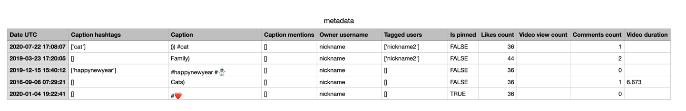

# instagram_content_downloader

## Description

Script was written quickly, it seems that there are places that can be optimized and improved, but I did not have such a
goal 🙃

### This script was written for the following purposes:

1. Learning how to download content from Instagram
2. Find out how many likes I had at most for all time (44) 🤣

### What the script does:

1. Downloads all posts from the profile (photos and videos)
2. Downloads all comments to posts
3. Files with the following metadata are generated:
   ``` json
   {
       "Date UTC": "2016-09-06 07:29:21",
       "Caption hashtags": [
           "cat"
       ],
       "Caption": ))) #cat",
       "Caption mentions": [],
       "Owner username": "<username>",
       "Tagged users": [],
       "Is pinned": false,
       "Likes count": 36,
       "Video view count": 0,
       "Comments count": 1,
       "Video duration": 6.673
   }
   ```
   3.1. Then the function `convert_all_custom_metadata_to_csv` is called, which collects all metadata and saves it to
   a `csv` file.

## Installation

At the time of writing this script (`2024-08-10`), there were problems with the `instaloader` library.
The fix is indicated [here](https://github.com/instaloader/instaloader/issues/2319#issuecomment-2267614752).
Once the problem is resolved, the script will work without additional actions and by simply installing the library.

### To install you need:

1. Download the repository
2. Install python 3.12.* (may work on newer versions)
3. Install dependencies by running `setup.sh` (tested on `macOS`)

## Example of a generated file with metadata


